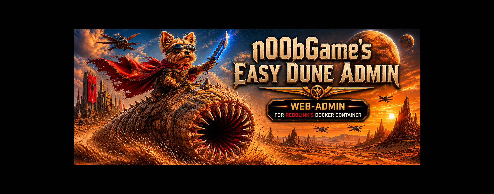
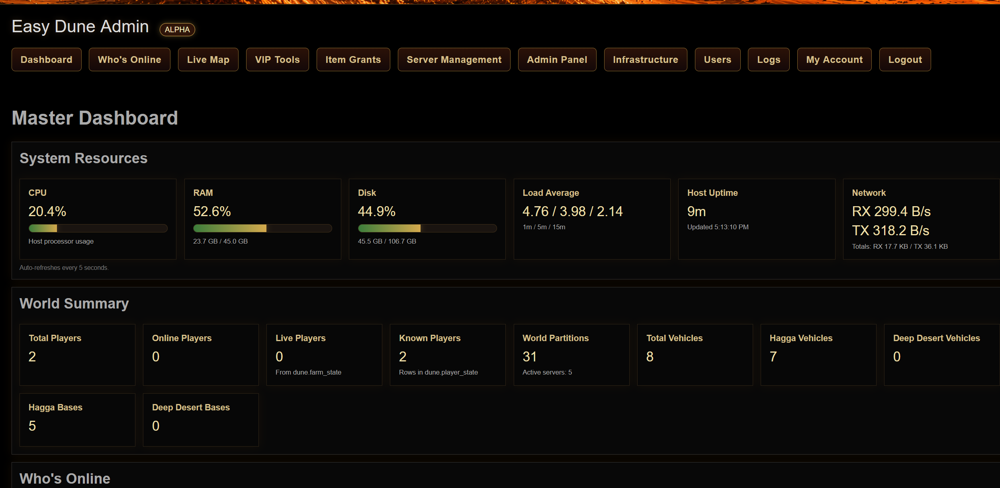
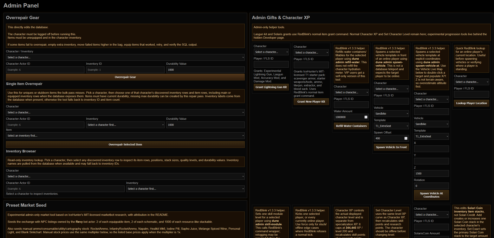
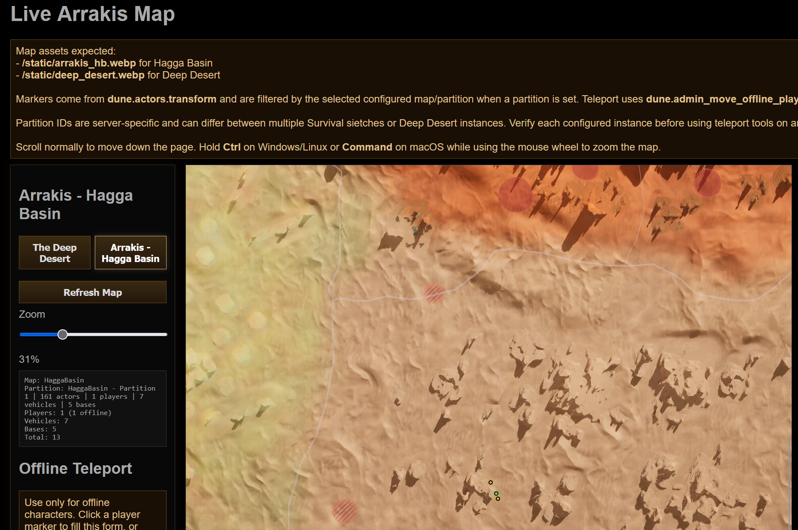
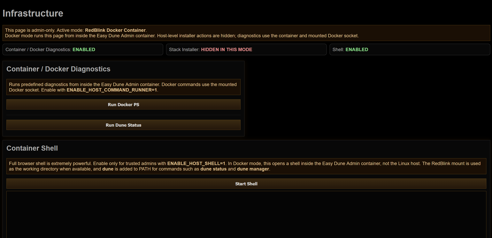
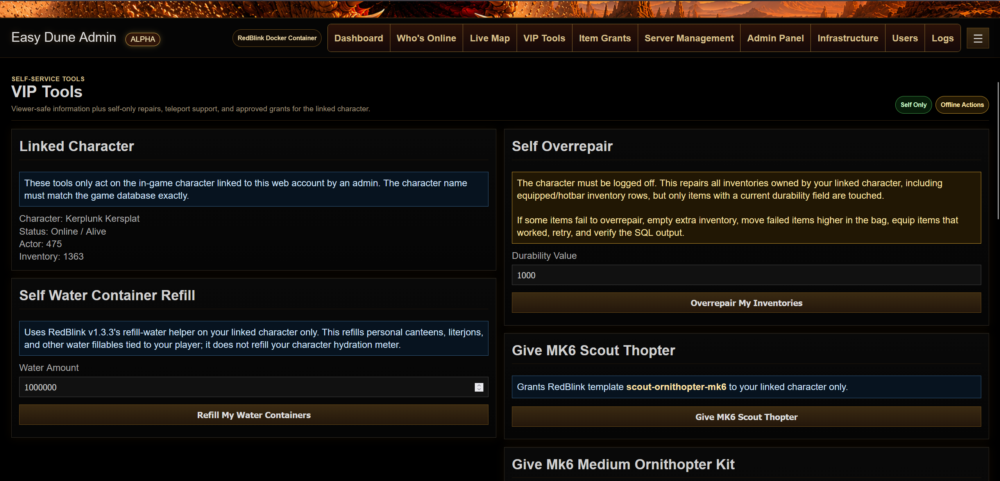

<h1 align="center">Easy Dune Admin</h1>

<p align="center">
  Independent companion administration platform for RedBlink's Dune Awakening self-hosted Docker stack.
</p>

<p align="center">
  
  
  
  
  
  
</p>

<p align="center">
  
</p>

---

## Status

Current panel version: `0.8.8-beta`

Target RedBlink Stack: `v1.3.16`

This beta is intended for private/LAN/VPN-hosted self-hosted servers.

Easy Dune Admin is an independent webadmin project built to support
RedBlink's MIT-licensed
[`dune-awakening-selfhost-docker`](https://github.com/Red-Blink/dune-awakening-selfhost-docker)
stack. Development is being continued with RedBlink's permission, while keeping
RedBlink's stack, scripts, command workflows, and contributors credited where
they are used or targeted.

---

## Screenshots

Some screenshots are captured at reduced browser zoom levels to show more of the interface in a single image.

### Dashboard



### Admin Panel



### Live Map



### Docker Infrastructure



### VIP Tools



### Android App


### RedBlink Manager Shell Workflow


---

## Features

### Dashboard

- Live CPU/RAM/Disk usage bars
- Network RX/TX totals and rates
- AJAX auto-refresh
- World/player/vehicle summary cards
- Full-width online player table with character, status, Funcom ID, map, and partition

### Live Maps

- Hagga Basin live map
- Deep Desert map support
- Configurable map instances for multi-sietch / dual Deep Desert setups
- Player, vehicle, and base markers
- Offline character markers render purple so they are distinct from online players
- Mouse-wheel zoom
- Drag panning
- Click-to-fill teleport coordinates

### Teleportation

- Offline teleportation
- Character dropdown targeting
- Emergency return to safe Hagga Basin point
- Live map and VIP self teleport use a DB-observed map partition picker instead of raw partition entry
- Multi-partition map/teleport support is experimental and currently untested until additional Survival or Deep Desert instances are available
- Default Hagga Basin partition: `1`
- Default Deep Desert partition: `8`
- Partition IDs are server-specific and may differ between multiple Survival or Deep Desert instances

### Vehicle Teleport

- Admin-only vehicle relocation using `dune.actors`
- Preserves existing vehicle rotation while updating map, partition, and XYZ
- Supported actor families: Ornithopter, Sandbike, Buggy, TreadWheel, SandCrawler
- Zoomable, draggable admin vehicle map with double-click coordinate targeting
- Requires restarting the affected map/server instance before loaded vehicles appear at the new location
- Z-axis warning because below-terrain values can place vehicles underground

### Item Grants

- Item search
- Item grant tools
- Admin-only Builder Supply Packs that insert curated build resources into empty main-backpack slots after validating free space. These can temporarily overload character carry weight, so equip a build tool before using them.
- Admin-only Base Storage Warehouse Fill that discovers owned large base containers, validates four empty selections, and fills them with a curated four-box resource/component layout. Restart the affected map before expecting new container contents to appear in game.
- Admin-only Base Storage Empty tool that discovers owned base storage containers of any size, validates up to four selected containers, and deletes only their item rows. Restart the affected map before expecting emptied containers to update in game.
- Mk6 Scout Ornithopter grant
- Mk6 Medium Ornithopter grant
- Medium thopter kit includes 250 rockets, one RepairTool5, and 500 WeldingMaterial
- Admin-only Lightning Gun kit grant using the normal RedBlink item grant command
- Admin-only hydration water-pack grant using RedBlink's normal item grant command for `WaterPack_Consumable x250`
- Admin-only SolarisCoin grant with preset amount dropdown
- Admin-only Solari Coin inventory-stack lookup, add, and set-exact correction tools
- Admin-only Solari Credit lookup, add, and set-exact correction tools for the live exchange/bank balance
- Admin-only research point setter for selected characters
- Admin-only character XP grant for the actual displayed character level
- Admin-only set character level tool using the same level XP curve
- Admin-only skill point grant that adds usable skill points without changing character level XP
- Admin-only live unspent skill point setter using RedBlink v1.3.16's `dune admin skill-points` / `SkillsSetUnspentSkillPoints` RabbitMQ command. This is an experimental compare-path that sets the current unspent value; it may not change total earned skill points.
- Admin-only bulk skill-module presets for catalog-validated skill key/capstone and ability unlock testing through RedBlink v1.3.16's `dune admin skill-module` helper
- Item grants target the selected player/account inventory path and do not use map partition IDs
- Developer-only specialization XP setter and maxer for Combat, Crafting, Gathering, Exploration, and Sabotage tracks through RedBlink v1.3.16's `dune admin specialization-xp` and `dune admin specialization-max` helpers, which create database backups before writes.
- Developer-only legacy specialization inspection/reset tools for one track or all tracks plus keystones while augment/stat research continues.
- Developer-only legacy Class Progression tag cleanup for Planetologist, Trooper, and Advanced Bene Gesserit test tags. The old tag-only apply path remains hidden because tags alone are not sufficient for real class unlocks.
- Developer-only starter class FGL state tool based on IceHunter / Ryan Wilson's MIT-licensed 0.25.1 progression research. It sets `StarterSkillTreeTag` and grants the selected starter ability for Bene Gesserit, Mentat, Planetologist, Swordmaster, or Trooper.
- Developer-only Prescience / third combat skill slot repair/diagnostic tool, based on IceHunter / Ryan Wilson's MIT-licensed 0.25.1 progression research, that enables the DuneCharacter `SpiceVisionEnabledStatus` side effect used by Find the Fremen and reports FGL, tag, and journey-node state.
- Admin-only faction progression presets for Atreides/Harkonnen Chapter 3 / Rank 5 and Rank 19 eligibility. These complete faction journey nodes, write faction tags, set faction alignment/reputation, and rebuild the controller faction component.
- Experimental Developer-only progression preset apply/reset tools for curated journey roots. Find the Fremen applies the known Trials-of-Aql node spine plus the Prescience repair path because root journey rows alone may miss required side effects; resetting it also removes the Prescience repair state so the Trials can be retried naturally.
- Developer-only Find the Fremen Epilogue reset for recovery cases where the Trials are available again but the Epilogue remains marked complete after broader progression edits.
- Developer-only progression recovery tools for resetting skill ModuleData, granting/resetting all specialization keystones with skill-point repair, deleting tutorial rows, and wiping codex/mnemonic recall state.
- Progression edits may require relogging, restarting the affected map, or restarting the battlegroup. Restarts can appear slow, and login may briefly show an error before recovering.

### Market Tools

- Admin-only preset market seeding
- Seeds NPC exchange listings for every tradeable non-emote item in the Easy Dune Admin catalog, including equippables, schematics, resources, consumables, ammunition, utility items, and cartography tools
- Adds manual NPC stock for RocketAmmo, InfantryRocketAmmo, Napalm, Healkit Mk6, Iodine Pill, Sapho Juice, Melange Spiced Wine, Personal Light, and Blank Sinkchart
- Uses a `Revy`-style bot owner and `is_npc_order = TRUE`
- Seed Exchange selector is populated from observed database exchange IDs and supports servers whose visible player market is not the DB `Global` exchange id
- Default preset clears only the market bot's existing NPC listings before reseeding
- Per-run price multiplier input defaults to 5x so Solari keeps value on private servers
- Items or schematics with names/IDs containing `wing`, `track`, or `locomotion` seed 8 listings by default
- Refined resources use an additional 2.5x category price multiplier
- Raw resources use an additional 5x category price multiplier, with overrides for Spice Sand/Residue, Titanium Ore, Stravidium Mass, Agave Seeds, and Basalt Stone
- Clear NPC Market Listings button removes the bot's NPC listings without relisting
- Buy Eligible Player Listings lets Revy buy player listings priced at or below 60% of the current preset price
- Buyback threshold, max buys per sweep, and sweep interval are editable in the Admin UI
- Start/Stop Buyback Sweep controls run Revy buyback immediately once, then on the configured interval while Easy Dune Admin is running
- Start/Stop Market Reseed controls clear Revy's NPC listings and reseed preset stock immediately once, then on the configured interval while Easy Dune Admin is running
- Market category mapping and item-data research adapted from IceHunter / Ryan Wilson's MIT-licensed dune-admin project

### Repair Tools

- Admin-only gear overrepair
- Admin-only single item overrepair picker for character-owned inventories, useful for uniques or items missed by the bulk pass
- Admin-only vehicle module repair
- Sane default repair values with editable durability fields

### VIP Tools

- VIP role with viewer-safe access plus self-service tools
- Admin-managed exact character-name link for each VIP web account
- Self-only overrepair across all inventories owned by the linked character, including equipped/hotbar rows with current durability
- Self-only offline teleport using the linked character account/FLS ID
- Self-only Mk6 Scout and Mk6 Medium Ornithopter grants
- Self-only hydration water-pack grant for `WaterPack_Consumable x250`

### Server Management

- Grouped restart controls:
  - Gameplay Services: Survival, Deep Desert, Overmap
  - Infrastructure Services: Gateway, Director, Text Router
- Map spawn controls
- RedBlink v1.3.16 Dune Docker Console controls:
  - `dune console status`
  - `dune console restart`
- RedBlink v1.3.16 battlegroup overview controls:
  - `dune status`
  - `dune ready`
  - `dune version`
  - `dune ports`
  - `dune ps`
  - `dune servers`
  - `dune doctor`
- RedBlink v1.3.16 map runtime controls:
  - `dune maps list`
  - `dune maps mode`
  - `dune maps set <map> dynamic`
  - `dune maps set <map> always-on`
  - `dune maps reconcile`
- RedBlink v1.3.16 autoscaler controls:
  - `dune autoscaler status`
  - `dune autoscaler logs`
  - `dune autoscaler start|stop|restart`
- RedBlink v1.3.16 Sietch and memory controls:
  - `dune sietches list|show|dimensions|sync|validate`
  - `dune memory status|list-maps|set|unset`
- RedBlink v1.3.16 update check/status controls:
  - `dune self-update check|list`
  - `dune update check`
  - `dune update auto status`
  - `dune restart-schedule status`
- RedBlink v1.3.16 admin helpers:
  - `dune admin players`
  - `dune admin player-location`
  - `dune admin refill-water`
  - `dune admin spawn-vehicle`
  - `dune admin spawn-vehicle-at`
  - `dune admin skill-module`
  - `dune admin kick`
  - `dune admin vehicle-list`
  - `dune admin item-search`
  - `dune admin item-list`
  - `dune admin award-xp`
  - `dune admin specialization-xp`
  - `dune admin specialization-max`
  - `dune admin clean-inventory`
  - `dune admin reset-progression`
  - `dune admin broadcast-restart-warning`
  - `dune admin history`

RedBlink v1.3.16 includes Dune Docker Console and Community Addons support. Easy Dune Admin remains a separate companion panel for now, but the addon model is a useful future integration path. RedBlink currently exposes one grant-template, `scout-ornithopter-mk6`; Easy Dune Admin's Medium Ornithopter kit uses the normal RedBlink item grant command as a bundled workflow rather than a RedBlink grant-template.

### Deep Desert

- Dual PvP/PvE status
- Enable dual mode
- Disable dual mode
- Force disable dual mode
- Bootstrap dual mode
- Repair dual mode

### Database Tools

Safe database actions:

- DB Health
- DB Status
- List Backups
- Create Backup

Restore/import/delete database actions are intentionally not exposed yet.

### Infrastructure

- Host diagnostics
- Docker diagnostics
- Easy Dune Admin GitHub update + Docker rebuild for Linux Host and Docker installs
- Guided RedBlink installer
- Browser-based host shell
- Open Shell + `dune init`
- Open Shell + `dune manager`, which starts or reports RedBlink v1.3.16's Dune Docker Console
- Easy Dune Admin port switcher for Docker installs, guarded by confirmation and `.env` updates
- RedBlink Console addon installer for the native `EDA Exchange Bot` market-preview slice

### Mobile / PWA

- Progressive Web App metadata for install-to-home-screen support on phones and tablets
- Uses the existing Easy Dune Admin icons for app installation
- Root-scoped service worker serves a simple offline fallback when the panel is unreachable
- Authenticated pages and API responses remain network-first and are not intentionally cached for offline admin-data viewing
- Keep mobile access behind LAN/VPN or other private access controls; do not expose the panel directly to the public internet
- Optional sideloadable Android APK wrapper lives in [`android-app/`](android-app/README_ANDROID.md). It opens your existing Easy Dune Admin server in a native WebView and stores only the server URL on the phone.
- Admin users can reach Developer Tools from the hamburger menu in the Android/PWA UI. The page still requires the separate Developer key before any research commands are visible.

Android PWA install:

1. Connect the phone to the same LAN or VPN as the Easy Dune Admin server.
2. Open Chrome on Android and browse to `http://SERVER-IP:8089`.
3. Log in once so Chrome sees the app as usable.
4. Open Chrome's menu and choose `Install app` or `Add to Home screen`.
5. Launch Easy Dune Admin from the new home-screen icon.

If Chrome only offers `Add to Home screen`, use that option. No rooted phone is required.

Android APK build:

1. Open `android-app` in Android Studio.
2. Build `app` with `Build > Build Bundle(s) / APK(s) > Build APK(s)`.
3. Or build from a terminal with the included Gradle wrapper. Java 17 and the Android SDK are still required.

```powershell
cd android-app
.\gradlew.bat assembleDebug
```

Linux/macOS:

```bash
cd android-app
chmod +x gradlew
./gradlew assembleDebug
```

The debug APK is written to:

```text
android-app/app/build/outputs/apk/debug/EDA.apk
```

If the Gradle wrapper starts but fails on Android SDK licenses or missing
packages, install/accept the SDK components first:

```powershell
$env:ANDROID_SDK_ROOT="$env:LOCALAPPDATA\Android\Sdk"
& "$env:ANDROID_SDK_ROOT\cmdline-tools\latest\bin\sdkmanager.bat" --install "platforms;android-35" "build-tools;34.0.0" "platform-tools"
& "$env:ANDROID_SDK_ROOT\cmdline-tools\latest\bin\sdkmanager.bat" --licenses
```

If the SDK reports `package.xml (Access is denied)`, repair permissions or
reinstall that SDK platform/build-tools with Android Studio's SDK Manager.

Android APK sideload:

1. Copy `EDA.apk` to the phone by USB, file share, cloud drive, or Android file transfer.
2. Open `EDA.apk` from the phone's Files app or file manager.
3. Android will usually block the first install attempt because the APK was not installed from Google Play.
4. When prompted, open the Android settings screen for that file manager/browser and allow installs from that source.
5. Return to the APK and continue the install.
6. Launch Easy Dune Admin.
7. Enter your LAN/VPN/HTTPS Easy Dune Admin URL, such as `http://SERVER-IP:8089` or `https://eda.example.com`.

No rooted phone is required. To update an existing sideloaded install, build a new `EDA.apk` and install it over the old one.

Release packaging note:

- The Android wrapper source lives in `android-app/` and should be committed with the repository.
- The built `EDA.apk` is ignored by Git and should be attached to GitHub Releases only as an optional convenience artifact.
- Suggested release wording: `Optional Android WebView wrapper. Sideload at your own discretion. Android will block the first install attempt because this APK is not from Google Play; allow installs from that source if you trust this release. The APK stores only the configured Easy Dune Admin server URL and defaults to http://127.0.0.1:8089.`

---

## Requirements

```bash
sudo apt update
sudo apt install -y \
python3 \
python3-pip \
python3-venv \
git \
curl
```

---

## Installation

```bash
git clone https://github.com/n00bgames/Easy-Dune-Admin.git easy-dune-admin
cd easy-dune-admin
cp .env.docker.example .env
nano .env
chmod +x rebuild_docker.sh docker/entrypoint.sh
./rebuild_docker.sh
```

Before first start, edit `.env`:

- Set `REDBLINK_HOST_DIR` to the host path where RedBlink's stack lives.
- Set `EASY_DUNE_HOST_DIR` to the absolute host path of this Easy Dune Admin checkout if you want the Docker-mode Infrastructure update button.
- Change `DUNE_SECRET_KEY` before sharing the panel outside your own machine.
- Keep `ENABLE_SELF_UPDATE=1` for the one-click Infrastructure updater, or set it to `0` to hide that button.
- The default web port is `8089`; change `EDA_PORT` if needed.

Browse to:

```text
http://SERVER-IP:8089
```

Docker is the primary supported install method as of `0.8.8-beta`. Runtime
webadmin state is stored in the named Docker volume `easy-dune-admin-data`, so
normal rebuilds preserve `users.db`, roles, and logs. Do not run
`docker compose down -v` unless you intentionally want to reset the webadmin.

Existing Docker installs upgrading from the older `8088` default can change the
published web port in `.env` and rebuild:

```bash
cd /path/to/easy-dune-admin
nano .env
```

Set or update:

```bash
EDA_PORT=8089
```

Save, then apply the port change:

```bash
FOLLOW_LOGS=0 ./rebuild_docker.sh
```

See `DOCKER.md` for Docker mount and production notes.

For Docker mode, keep `DUNE_ROOT_CONTAINER` equal to `REDBLINK_HOST_DIR` in
`.env`. RedBlink restart/spawn scripts create sibling containers through the
host Docker socket, so their bind-mount source paths must also exist on the
host. Mounting the stack at a container-only alias such as `/redblink` can break
`dune restart survival` because Docker looks for `/redblink` on the host.

Clean uninstall is documented in `DOCKER.md`. The Infrastructure page also has
an admin-only Clean Uninstall panel that removes the Easy Dune Admin Docker
stack and named webadmin data volume while leaving RedBlink and the host
checkout untouched.

### Advanced Local Install

The legacy local Python launch remains available for Linux hosts that prefer
running Easy Dune Admin directly outside a container:

```bash
python3 -m venv venv
source venv/bin/activate
pip install -r requirements.txt

chmod +x setup.sh
./setup.sh

chmod +x start.sh restart.sh shutdown.sh
./start.sh
```

Browse to:

```text
http://127.0.0.1:8089
```

---

## Runtime Control

```bash
./start.sh --screen       # detached GNU screen session
./start.sh --headless     # nohup background process with webadmin.pid
./restart.sh              # restarts using the detected/current launch mode
./shutdown.sh             # stops screen or headless mode
```

For screen mode:

```bash
screen -r dune-admin-web
```

Detach from screen with `Ctrl+A`, then `D`.

---

## Configuration

Default RedBlink stack path:

```bash
~/dune-awakening-selfhost-docker
```

Override with:

```bash
export DUNE_ROOT=/path/to/dune-awakening-selfhost-docker
```

Login installation profile:

Easy Dune Admin now has a login switch for `Linux Host`, `RedBlink Docker Container`, and experimental `Hyper-V via SSH` operation. Linux Host and RedBlink Docker Container run commands locally. Hyper-V via SSH runs those same RedBlink/Docker commands through SSH on the Linux VM.

```bash
export EASY_DUNE_DEFAULT_INSTALL_MODE=linux
export EASY_DUNE_HYPERV_SSH_TARGET='steam@192.168.1.50'
export EASY_DUNE_HYPERV_DUNE_ROOT=/home/steam/dune-awakening-selfhost-docker
```

Leave the Hyper-V values unset unless you are using the Hyper-V profile.

Set a real secret before sharing or deploying:

```bash
export DUNE_SECRET_KEY='long-random-string'
```

Developer page key:

The hidden `/developer` page is for incomplete, dangerous, broken, experimental, or research-only tools. Developer functions can corrupt progression, flags, inventories, or player state if used casually. The page is admin-only and also protected by a separate key hash. Set your own hash instead of relying on the bundled fallback:

```bash
python3 - <<'PY'
from werkzeug.security import generate_password_hash
print(generate_password_hash("replace-this-with-your-developer-key"))
PY

export EASY_DUNE_DEVELOPER_KEY_HASH='pbkdf2:sha256:...'
```

Restart Easy Dune Admin after changing `EASY_DUNE_DEVELOPER_KEY_HASH`.

Optional high-trust infrastructure features:

```bash
export ENABLE_HOST_COMMAND_RUNNER=1
export ENABLE_STACK_INSTALLER=1
export ENABLE_HOST_SHELL=1
export ENABLE_SELF_UPDATE=1
```

With `ENABLE_SELF_UPDATE=1`, the Infrastructure page can pull the latest Easy
Dune Admin source from GitHub, refuse a dirty local checkout, run
`FOLLOW_LOGS=0 ./rebuild_docker.sh`, and restart the webadmin Docker daemon.
Linux Host mode runs that update inline. Docker mode starts a detached
`easy-dune-admin-updater` container against `EASY_DUNE_HOST_DIR` so the updater
can keep running while the webadmin container is rebuilt and replaced.
If the local checkout is ahead of GitHub or diverged from its upstream branch,
the updater refuses to run so a devbuild is not replaced by an older pushed
release.
Docker rebuilds stamp the image with the Git revision and dirty-state used to
build it. The normal updater also refuses when the running image was built from
dirty source or when the running image revision does not match the mounted host
checkout. In Docker mode, those checks run as a foreground preflight first, so
the panel reports when an update was aborted instead of only saying the detached
updater started.

The neighboring Clean Reinstall button is the repair path for a damaged install
or an intentional forced replacement. It requires typing `CLEAN INSTALL`, resets
the checkout to upstream GitHub, removes untracked source/build files, preserves
`.env` and common local runtime paths, then rebuilds Docker.

The neighboring port switcher updates `EDA_PORT` in `.env`, rebuilds/recreates
the Easy Dune Admin Docker service, and then expects you to reopen the panel on
the new port. It is intended for Docker-style installs where this project owns
the published webadmin port.

The RedBlink Console addon installer writes a native `eda-exchange-bot` addon
under RedBlink's `runtime/addons/installed` directory. This does not replace the
standalone Easy Dune Admin panel. The `EDA Exchange Bot` addon previews Easy
Dune Admin's seed plan and runs one-shot market seed, buyback, clear-NPC, and
unsafe-listing cleanup actions through RedBlink's permissioned `database:write`
addon bridge. RedBlink keeps DB credentials and creates the database backup
before write SQL runs. Additional Easy Dune Admin features can be cherry-picked
as native addon slices over time. See
[`docs/REDBLINK_ADDON_STRATEGY.md`](docs/REDBLINK_ADDON_STRATEGY.md).

Docker-mode self-update also needs the absolute host checkout path:

```bash
export EASY_DUNE_HOST_DIR=/path/to/easy-dune-admin
```

Optional RedBlink installer target override:

```bash
export REDBLINK_INSTALL_DIR=/path/to/dune-awakening-selfhost-docker
```

Optional multi-instance map/teleport override:

```bash
export EASY_DUNE_MAP_CONFIGS_JSON='{"HaggaBasin":{"key":"HaggaBasin","label":"Hagga Basin 1","actor_map":"HaggaBasin","image":"arrakis_hb.webp","width":8000,"height":8000,"min_x":-456752.21,"max_x":354547.46,"min_y":-450630.14,"max_y":353821.95,"flip_y":false,"default_partition_id":1},"HaggaBasin2":{"key":"HaggaBasin2","label":"Hagga Basin 2","actor_map":"HaggaBasin","image":"arrakis_hb.webp","width":8000,"height":8000,"min_x":-456752.21,"max_x":354547.46,"min_y":-450630.14,"max_y":353821.95,"flip_y":false,"default_partition_id":12}}'
```

Use verified partition IDs from your own database/runtime state. Do not assume another server's Survival or Deep Desert partition IDs match yours.

Teleport-capable roles can query `/api/map-partitions` after logging in to see observed `dune.actors.map` / `partition_id` pairs with actor, player, vehicle, and base counts.

---

## Docker Package

The root `Dockerfile`, `docker-compose.yml`, `.env.docker.example`,
`docker/entrypoint.sh`, and `rebuild_docker.sh` are the primary deployment
package. The container mounts the host RedBlink stack directory and Docker socket
instead of bundling RedBlink inside the image.

Docker webadmin state is stored in the named Docker volume
`easy-dune-admin-data` at `/data`, including `/data/users.db` and `/data/logs`.
Rebuilding the image should preserve users and roles as long as the volume is
not removed. Avoid `docker compose down -v` unless you intentionally want to
reset the webadmin database.

Docker-mode catalog edits try to preserve host ownership for
`data/easy-dune-item-catalog.json`. If an older container saved the catalog as
`root` and your normal VM user cannot overwrite it, repair from the Docker host:

```bash
sudo chown "$USER:$USER" /path/to/easy-dune-admin/data
sudo chown "$USER:$USER" /path/to/easy-dune-admin/data/easy-dune-item-catalog.json
```

See `DOCKER.md` for setup notes.

---

## Upgrading

Before replacing a running copy, back it up:

```bash
cp -a ~/dune-admin-web ~/dune-admin-web.backup-before-0.8.8-beta
```

Preserve local runtime data:

- `users.db`
- `logs/`
- `.env`, if used

Then update:

```bash
git pull
cp .env.docker.example .env   # only if .env does not already exist
nano .env                     # verify REDBLINK_HOST_DIR, EASY_DUNE_HOST_DIR, and secrets
./rebuild_docker.sh
```

For the advanced local Python install, run `pip install -r requirements.txt`
inside the virtualenv and restart with `./restart.sh`.

---

## Runtime Assets

Runtime assets live in `static/`:

- `dune-admin.js`
- `dune-admin.png`
- `dune-admin-large.png`
- `arrakis_hb.webp`
- `deep_desert.webp`

The map image files are required for the live map pages to render properly.

Optional item icons are local-only. Easy Dune Admin ships catalog icon path
metadata, but does not redistribute Dune: Awakening icon image assets. For a
private install, place personally supplied icon files in `static/item-icons` in
the mounted Easy Dune Admin checkout, `/data/item-icons` for Docker-persistent
storage, or set `EDA_ITEM_ICON_DIR` to another local folder. Matching catalog
filenames are served to the item picker automatically, and the actual image
files are ignored from Git and Docker release builds. Developer Tools includes an Item Icon Pack
Utility that lists present and missing local icon filenames and provides a
copyable filename manifest.

Easy Dune Admin includes original `base-schematic.png` and `base-augment.png`
fallbacks for schematic/blueprint and augment entries that do not have an exact
local icon match, plus an original `base-unknown.png` question-mark fallback
for other unmatched entries.

GitHub README screenshots live in `images/`:

- `dashboard.png`
- `dune-manager.png`
- `infrastructure-docker.png`
- `infrastructure.png`
- `live-map.png`
- `logo.png`
- `vip.png`

When dashboard, live map, infrastructure, Docker infrastructure, VIP, or README sections change, refresh the matching image before publishing.

---

## Line Endings

The repository includes `.gitattributes` rules to keep Linux shell scripts using LF line endings.

If shell scripts still fail with `cannot execute: required file not found` or `/bin/bash^M`, run:

```bash
find . -type f -name "*.sh" -exec sed -i 's/\r$//' {} \;
chmod +x setup.sh start.sh restart.sh shutdown.sh
```

---

## Security Notes

This project is intended for LAN/private/VPN environments. Do not expose it directly to the public internet.

Basic access testing has been performed over direct LAN, VPN, and HTTPS reverse-proxy paths. Command-level behavior should still be verified on your own stack before relying on high-impact admin actions remotely.

`setup.sh` creates a restricted sudoers file under:

```text
/etc/sudoers.d/dune-web-admin
```

The generated sudoers file allowlists only the optional Infrastructure installer commands Easy Dune Admin actually calls: selected `apt` installs, Docker service enablement, adding the webadmin user to the Docker group, RedBlink's `install-command.sh`, and the downloaded Docker bootstrap script at `/tmp/easy-dune-admin-get-docker.sh`. It does not grant `NOPASSWD: ALL`.

The optional browser host shell runs with the permissions of the Linux user that launches `app.py`. Treat it like SSH access to the host.

Viewer accounts are intentionally privacy-limited. They can see viewer-safe status, online player names, Funcom IDs, and map markers, but they cannot view sensitive database identifiers such as raw player IDs, account IDs, FLS IDs, direct logs, or admin database output.

---

## Known Issues

- Map marker styling is functional but still being refined.
- Autoscaler controls are planned.
- Vehicle repair writes directly to `dune.vehicle_modules` stats JSON.
- Vehicle teleport writes to `dune.actors`, but loaded vehicle actors do not reload their transform until the affected map/server instance restarts.
- Gear overrepair requires items to be unequipped and in inventory.
- Single item overrepair discovers inventory rows per selected character, so inventory IDs do not need to match between players.
- Teleport partition IDs should be verified on each stack/server setup, especially when running multiple Survival or Deep Desert instances.

---

## Planned

- VIP self-only generic item grants
- Vehicle ownership discovery for VIP self-repair/teleport
- Live map side panel / scroll-safe layout
- Autoscaler controls
- Dynamic map discovery from RedBlink map runtime config

---

## Release Notes

See `CHANGELOG.md` for full release history.

Current highlight for `0.8.8-beta`: Easy Dune Admin now targets RedBlink v1.3.16, adds Dune Docker Console integration controls, and can install a native RedBlink addon slice that previews and runs EDA exchange seed/buyback actions through RedBlink's permissioned addon bridge while the standalone panel remains fully supported.

Looking ahead: faction manipulation tools are a likely future focus after faction membership and the related database state can be captured and tested safely.

---

## Credits

- RedBlink and contributors for the MIT-licensed [`dune-awakening-selfhost-docker`](https://github.com/Red-Blink/dune-awakening-selfhost-docker) stack this panel targets. This project is being developed with RedBlink's permission; Easy Dune Admin remains an independent project and credits RedBlink's stack, scripts, command workflows, and the visual item-picker/care-package workflow concepts that inspired Easy Dune Admin's independent picker implementation.
- Funcom
- IceHunter / Ryan Wilson's MIT-licensed [`dune-admin`](https://github.com/Icehunter/dune-admin) project for market tooling research, category mapping, the Easy Dune Admin item catalog derived from bundled market item data, progression preset structure, specialization XP research, character-level XP curve research, and the T1 starter pack recipe adapted for the New Player Kit.
- Community researchers and testers; database research for some admin workflows was informed by early community testing.

---

## License

GPLv3. See `LICENSE`.

Third-party reference material remains under its original license. See `THIRD_PARTY_NOTICES.md` for included MIT license text and attribution.

---

## AI Collaboration Note

Large portions of this project have been collaboratively created with the use of generative AI tools, including ChatGPT and Codex.
