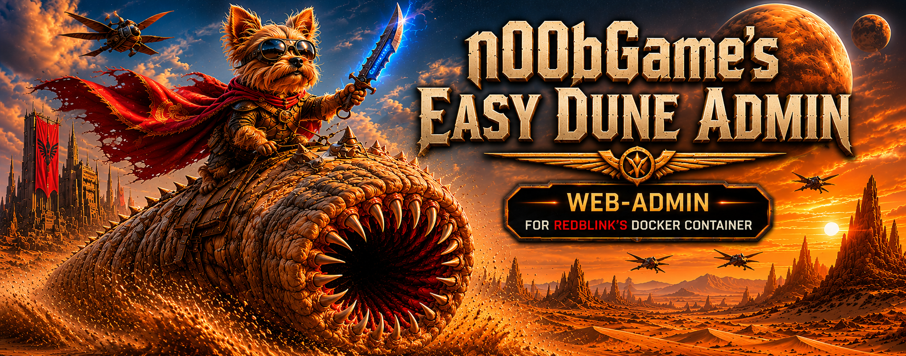
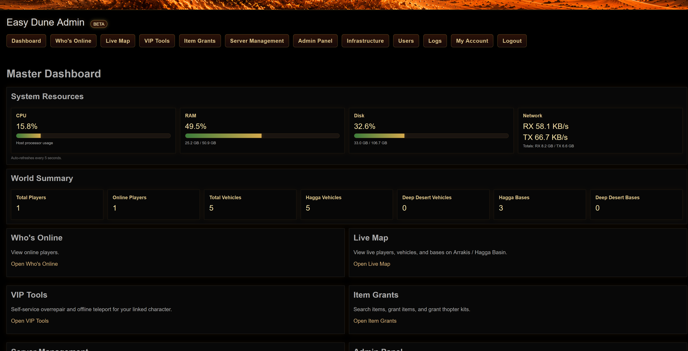
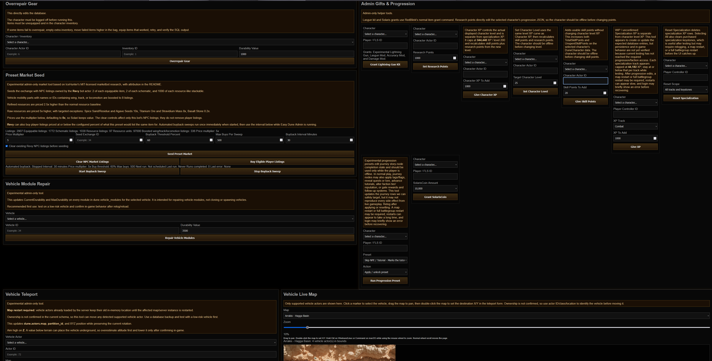
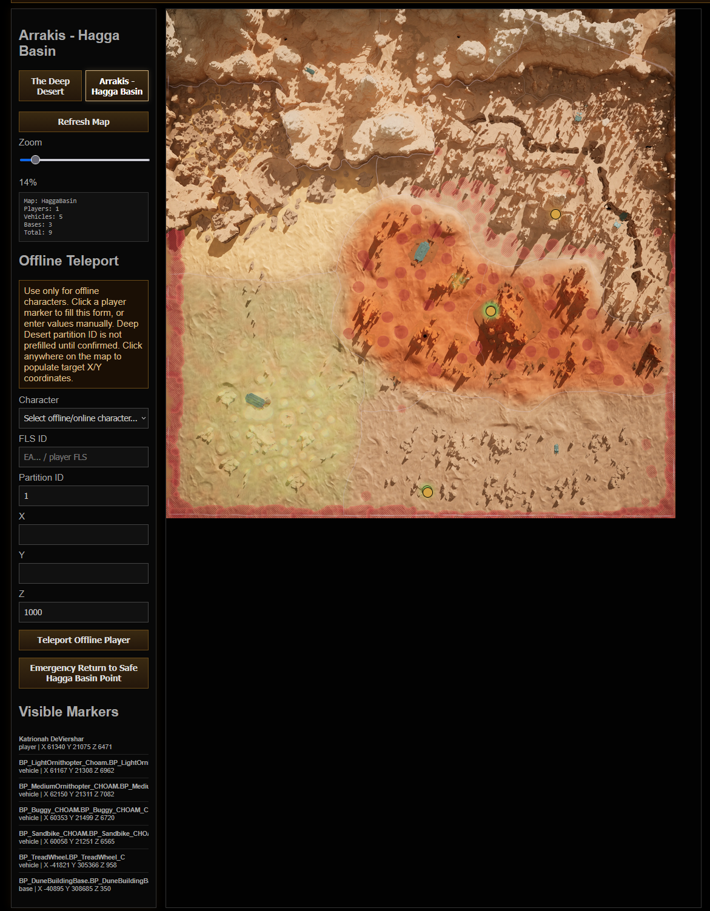
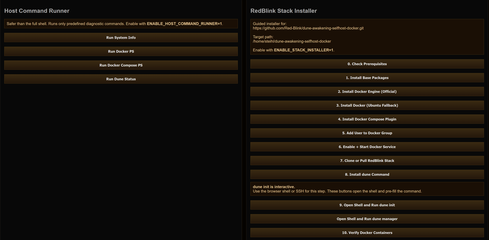
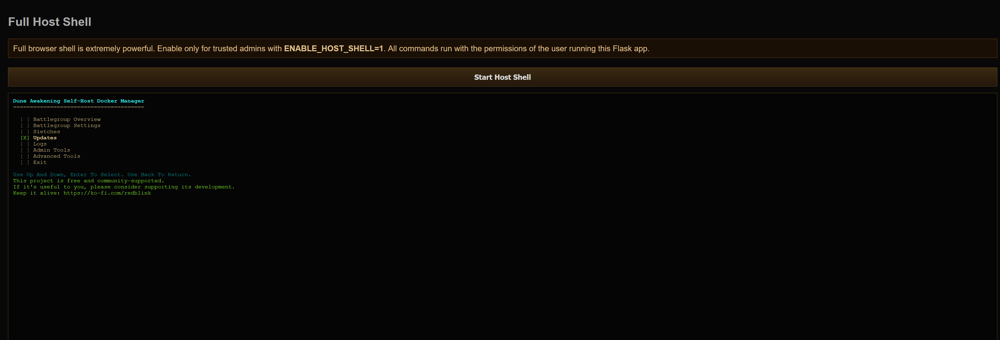

<h1 align="center">Easy Dune Admin</h1>

<p align="center">
  Independent companion administration platform for RedBlink's Dune Awakening self-hosted Docker stack.
</p>

<p align="center">
  
  
  
  
  
  
</p>

<p align="center">
  
</p>

---

## Status

Current panel version: `0.7.3-beta`

Target RedBlink Stack: `v1.3.3`

This beta is intended for private/LAN/VPN-hosted self-hosted servers.

Easy Dune Admin is an independent webadmin project built to support
RedBlink's MIT-licensed
[`dune-awakening-selfhost-docker`](https://github.com/Red-Blink/dune-awakening-selfhost-docker)
stack. Development is being continued with RedBlink's blessing/request for a
fuller webadmin, while keeping RedBlink's stack, scripts, command workflows,
and contributors credited where they are used or targeted.

---

## Screenshots

### Dashboard



### Admin Panel



### Live Map



### Infrastructure



### RedBlink Manager Shell Workflow



---

## Features

### Dashboard

- Live CPU/RAM/Disk usage bars
- Network RX/TX totals and rates
- AJAX auto-refresh
- World/player/vehicle summary cards
- Full-width online player table with character, status, Funcom ID, map, and partition

### Live Maps

- Hagga Basin live map
- Deep Desert map support
- Configurable map instances for multi-sietch / dual Deep Desert setups
- Player, vehicle, and base markers
- Mouse-wheel zoom
- Drag panning
- Click-to-fill teleport coordinates

### Teleportation

- Offline teleportation
- Character dropdown targeting
- Emergency return to safe Hagga Basin point
- Live map and VIP self teleport use a DB-observed map partition picker instead of raw partition entry
- Multi-partition map/teleport support is experimental and currently untested until additional Survival or Deep Desert instances are available
- Default Hagga Basin partition: `1`
- Default Deep Desert partition: `8`
- Partition IDs are server-specific and may differ between multiple Survival or Deep Desert instances

### Vehicle Teleport

- Admin-only vehicle relocation using `dune.actors`
- Preserves existing vehicle rotation while updating map, partition, and XYZ
- Supported actor families: Ornithopter, Sandbike, Buggy, TreadWheel, SandCrawler
- Zoomable, draggable admin vehicle map with double-click coordinate targeting
- Requires restarting the affected map/server instance before loaded vehicles appear at the new location
- Z-axis warning because below-terrain values can place vehicles underground

### Item Grants

- Item search
- Item grant tools
- Mk6 Scout Ornithopter grant
- Mk6 Medium Ornithopter grant
- Medium thopter kit includes 250 rockets
- Admin-only Lightning Gun kit grant using the normal RedBlink item grant command
- Admin-only SolarisCoin grant with preset amount dropdown
- Admin-only Solari Coin inventory-stack lookup, add, and set-exact correction tools
- Admin-only Solari Credit lookup, add, and set-exact correction tools for the live exchange/bank balance
- Developer-only research point setter for selected characters
- Admin-only character XP grant for the actual displayed character level
- Admin-only set character level tool using the same level XP curve
- Developer-only skill point grant that adds usable skill points without changing character level XP
- Item grants target the selected player/account inventory path and do not use map partition IDs
- WIP/unconfirmed Developer-only specialization tools for Combat, Crafting, Gathering, Exploration, and Sabotage tracks. These now target character pawn actor IDs, can add XP to one track, grant missing all-track rows at 0 XP for testing, or max all tracks plus discovered keystones.
- Developer-only specialization reset for one track or all tracks plus keystones
- WIP/experimental Developer-only Class Progression preset dropdown for observed trainer/class unlock tag bundles. Currently appears nonfunctional for actual in-game class unlocks because the account tags alone are not sufficient. The hidden `/developer` page also includes removal actions for the Planetologist, Trooper, and Advanced Bene Gesserit test tags.
- Experimental Developer-only progression preset apply/reset tools for curated journey roots. These are for testing/research only because advancing journey rows this way can currently lock the character out of the 3rd combat skill slot.
- Progression edits may require relogging, restarting the affected map, or restarting the battlegroup. Restarts can appear slow, and login may briefly show an error before recovering.

### Market Tools

- Admin-only preset market seeding
- Seeds NPC exchange listings for equippable items, schematics, and resources
- Adds manual NPC stock for RocketAmmo, InfantryRocketAmmo, Napalm, Healkit Mk6, Iodine Pill, Sapho Juice, Melange Spiced Wine, Personal Light, and Blank Sinkchart
- Uses a `Revy`-style bot owner and `is_npc_order = TRUE`
- Seed Exchange selector is populated from observed database exchange IDs and supports servers whose visible player market is not the DB `Global` exchange id
- Default preset clears only the market bot's existing NPC listings before reseeding
- Per-run price multiplier input defaults to 5x so Solari keeps value on private servers
- Items or schematics with names/IDs containing `wing`, `track`, or `locomotion` seed 8 listings by default
- Refined resources use an additional 2.5x category price multiplier
- Raw resources use an additional 5x category price multiplier, with overrides for Spice Sand/Residue, Titanium Ore, Stravidium Mass, Agave Seeds, and Basalt Stone
- Clear NPC Market Listings button removes the bot's NPC listings without relisting
- Buy Eligible Player Listings lets Revy buy player listings priced at or below 60% of the current preset price
- Buyback threshold, max buys per sweep, and sweep interval are editable in the Admin UI
- Start/Stop Buyback Sweep controls run Revy buyback immediately once, then on the configured interval while Easy Dune Admin is running
- Start/Stop Market Reseed controls clear Revy's NPC listings and reseed preset stock immediately once, then on the configured interval while Easy Dune Admin is running
- Market category mapping and item-data research adapted from IceHunter / Ryan Wilson's MIT-licensed dune-admin project

### Repair Tools

- Admin-only gear overrepair
- Admin-only single item overrepair picker for character-owned inventories, useful for uniques or items missed by the bulk pass
- Admin-only vehicle module repair
- Sane default repair values with editable durability fields

### VIP Tools

- VIP role with viewer-safe access plus self-service tools
- Admin-managed exact character-name link for each VIP web account
- Self-only overrepair across all inventories owned by the linked character, including equipped/hotbar rows with current durability
- Self-only offline teleport using the linked character account/FLS ID
- Self-only Mk6 Scout and Mk6 Medium Ornithopter grants

### Server Management

- Grouped restart controls:
  - Gameplay Services: Survival, Deep Desert, Overmap
  - Infrastructure Services: Gateway, Director, Text Router
- Map spawn controls
- RedBlink v1.3.3 battlegroup overview controls:
  - `dune status`
  - `dune ready`
  - `dune version`
  - `dune ports`
  - `dune ps`
  - `dune servers`
  - `dune doctor`
- RedBlink v1.3.3 map runtime controls:
  - `dune maps list`
  - `dune maps mode`
  - `dune maps set <map> dynamic`
  - `dune maps set <map> always-on`
  - `dune maps reconcile`
- RedBlink v1.3.3 autoscaler controls:
  - `dune autoscaler status`
  - `dune autoscaler logs`
  - `dune autoscaler start|stop|restart`
- RedBlink v1.3.3 Sietch and memory controls:
  - `dune sietches list|show|dimensions|sync|validate`
  - `dune memory status|list-maps|set|unset`
- RedBlink v1.3.3 update check/status controls:
  - `dune self-update check|list`
  - `dune update check`
  - `dune update auto status`
  - `dune restart-schedule status`
- RedBlink v1.3.3 admin helpers:
  - `dune admin players`
  - `dune admin player-location`
  - `dune admin refill-water`
  - `dune admin spawn-vehicle`
  - `dune admin vehicle-list`
  - `dune admin item-search`
  - `dune admin history`

RedBlink v1.3.3 currently exposes one grant-template, `scout-ornithopter-mk6`. Easy Dune Admin's Medium Ornithopter kit uses the normal RedBlink item grant command as a bundled workflow rather than a RedBlink grant-template.

### Deep Desert

- Dual PvP/PvE status
- Enable dual mode
- Disable dual mode
- Force disable dual mode
- Bootstrap dual mode
- Repair dual mode

### Database Tools

Safe database actions:

- DB Health
- DB Status
- List Backups
- Create Backup

Restore/import/delete database actions are intentionally not exposed yet.

### Infrastructure

- Host diagnostics
- Docker diagnostics
- Guided RedBlink installer
- Browser-based host shell
- Open Shell + `dune init`
- Open Shell + `dune manager`

---

## Requirements

```bash
sudo apt update
sudo apt install -y \
python3 \
python3-pip \
python3-venv \
git \
curl
```

---

## Installation

```bash
git clone https://github.com/n00bgames/Easy-Dune-Admin.git
cd Easy-Dune-Admin

python3 -m venv venv
source venv/bin/activate
pip install -r requirements.txt

chmod +x setup.sh
./setup.sh

chmod +x start.sh restart.sh shutdown.sh
./start.sh
```

Browse to:

```text
http://127.0.0.1:8088
```

---

## Runtime Control

```bash
./start.sh --screen       # detached GNU screen session
./start.sh --headless     # nohup background process with webadmin.pid
./restart.sh              # restarts using the detected/current launch mode
./shutdown.sh             # stops screen or headless mode
```

For screen mode:

```bash
screen -r dune-admin-web
```

Detach from screen with `Ctrl+A`, then `D`.

---

## Configuration

Default RedBlink stack path:

```bash
~/dune-awakening-selfhost-docker
```

Override with:

```bash
export DUNE_ROOT=/path/to/dune-awakening-selfhost-docker
```

Set a real secret before sharing or deploying:

```bash
export DUNE_SECRET_KEY='long-random-string'
```

Optional high-trust infrastructure features:

```bash
export ENABLE_HOST_COMMAND_RUNNER=1
export ENABLE_STACK_INSTALLER=1
export ENABLE_HOST_SHELL=1
```

Optional RedBlink installer target override:

```bash
export REDBLINK_INSTALL_DIR=/path/to/dune-awakening-selfhost-docker
```

Optional multi-instance map/teleport override:

```bash
export EASY_DUNE_MAP_CONFIGS_JSON='{"HaggaBasin":{"key":"HaggaBasin","label":"Hagga Basin 1","actor_map":"HaggaBasin","image":"arrakis_hb.webp","width":8000,"height":8000,"min_x":-456752.21,"max_x":354547.46,"min_y":-450630.14,"max_y":353821.95,"flip_y":false,"default_partition_id":1},"HaggaBasin2":{"key":"HaggaBasin2","label":"Hagga Basin 2","actor_map":"HaggaBasin","image":"arrakis_hb.webp","width":8000,"height":8000,"min_x":-456752.21,"max_x":354547.46,"min_y":-450630.14,"max_y":353821.95,"flip_y":false,"default_partition_id":12}}'
```

Use verified partition IDs from your own database/runtime state. Do not assume another server's Survival or Deep Desert partition IDs match yours.

Teleport-capable roles can query `/api/map-partitions` after logging in to see observed `dune.actors.map` / `partition_id` pairs with actor, player, vehicle, and base counts.

---

## Upgrading

Before replacing a running copy, back it up:

```bash
cp -a ~/dune-admin-web ~/dune-admin-web.backup-before-0.7.3-beta
```

Preserve local runtime data:

- `users.db`
- `logs/`
- `.env`, if used

Then update:

```bash
git pull
source venv/bin/activate
pip install -r requirements.txt
./start.sh
```

---

## Runtime Assets

Runtime assets live in `static/`:

- `dune-admin.js`
- `dune-admin.png`
- `dune-admin-large.png`
- `arrakis_hb.webp`
- `deep_desert.webp`

The map image files are required for the live map pages to render properly.

GitHub README screenshots live in `images/`:

- `dashboard.png`
- `dune-manager.png`
- `infrastructure.png`
- `live-map.png`
- `logo.png`

When dashboard, live map, infrastructure, or README sections change, refresh the matching image before publishing.

---

## Line Endings

The repository includes `.gitattributes` rules to keep Linux shell scripts using LF line endings.

If shell scripts still fail with `cannot execute: required file not found` or `/bin/bash^M`, run:

```bash
find . -type f -name "*.sh" -exec sed -i 's/\r$//' {} \;
chmod +x setup.sh start.sh restart.sh shutdown.sh
```

---

## Security Notes

This project is intended for LAN/private/VPN environments. Do not expose it directly to the public internet.

`setup.sh` creates a restricted sudoers file under:

```text
/etc/sudoers.d/dune-web-admin
```

The optional browser host shell runs with the permissions of the Linux user that launches `app.py`. Treat it like SSH access to the host.

Viewer accounts are intentionally privacy-limited. They can see viewer-safe status, online player names, Funcom IDs, and map markers, but they cannot view sensitive database identifiers such as raw player IDs, account IDs, FLS IDs, direct logs, or admin database output.

---

## Known Issues

- Map marker styling is functional but still being refined.
- Autoscaler controls are planned.
- Vehicle repair writes directly to `dune.vehicle_modules` stats JSON.
- Vehicle teleport writes to `dune.actors`, but loaded vehicle actors do not reload their transform until the affected map/server instance restarts.
- Gear overrepair requires items to be unequipped and in inventory.
- Single item overrepair discovers inventory rows per selected character, so inventory IDs do not need to match between players.
- Teleport partition IDs should be verified on each stack/server setup, especially when running multiple Survival or Deep Desert instances.

---

## Planned

- VIP self-only generic item grants
- Vehicle ownership discovery for VIP self-repair/teleport
- Live map side panel / scroll-safe layout
- Autoscaler controls
- Dynamic map discovery from RedBlink map runtime config

---

## Release Notes

See `CHANGELOG.md` for full release history.

Current highlight for `0.7.3-beta`: RedBlink `v1.3.3` support expands Server Management with battlegroup readiness, autoscaler, Sietches, memory, update checks, restart schedule status, selected `dune admin` helpers, Admin Panel water-container refill/player-location/vehicle-spawn utilities, and VIP self-only water-container refill.

Looking ahead: faction manipulation tools are a likely future focus after faction membership and the related database state can be captured and tested safely.

---

## Credits

- RedBlink and contributors for the MIT-licensed [`dune-awakening-selfhost-docker`](https://github.com/Red-Blink/dune-awakening-selfhost-docker) stack this panel targets. This project is being developed with RedBlink's blessing/request for a fuller companion webadmin; Easy Dune Admin remains an independent project and credits RedBlink's stack, scripts, and command workflows where used.
- Funcom
- IceHunter / Ryan Wilson's MIT-licensed [`dune-admin`](https://github.com/Icehunter/dune-admin) project for market tooling research, category mapping, bundled market item data, progression preset structure, specialization XP research, and character-level XP curve research.
- Community researchers and testers

---

## License

GPLv3. See `LICENSE`.

Third-party reference material remains under its original license. See `THIRD_PARTY_NOTICES.md` for included MIT license text and attribution.

---

## AI Collaboration Note

Large portions of this project have been collaboratively created with the use of generative AI tools, including ChatGPT and Codex.
